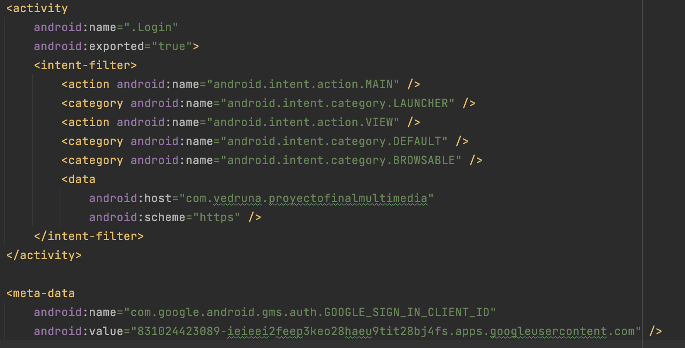
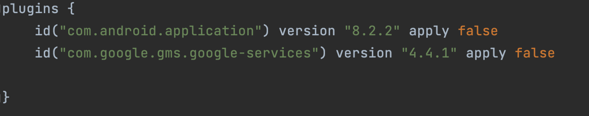
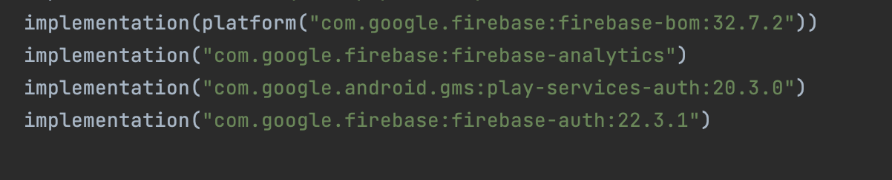
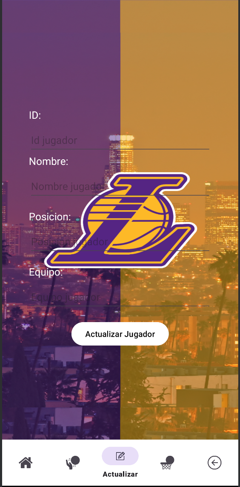
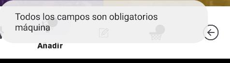
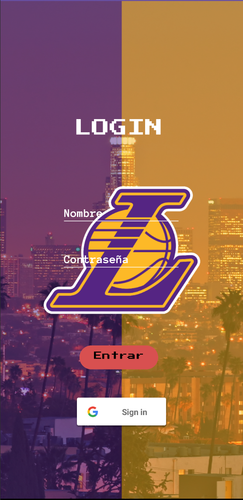
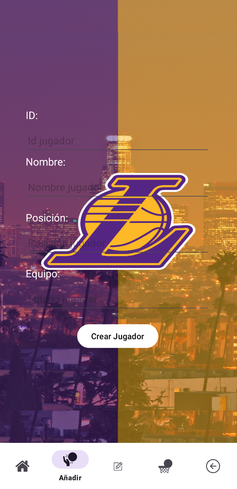
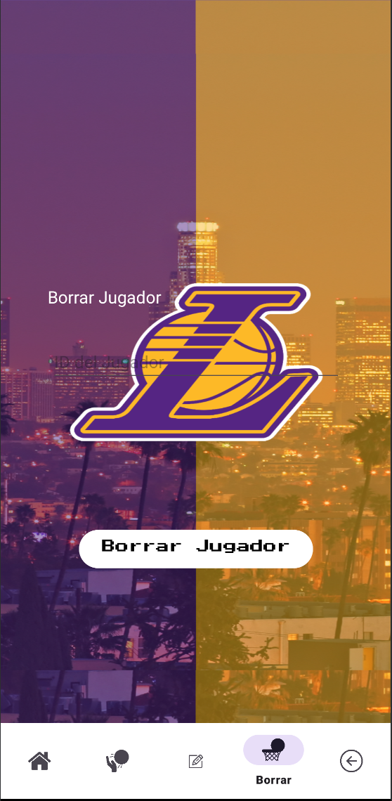
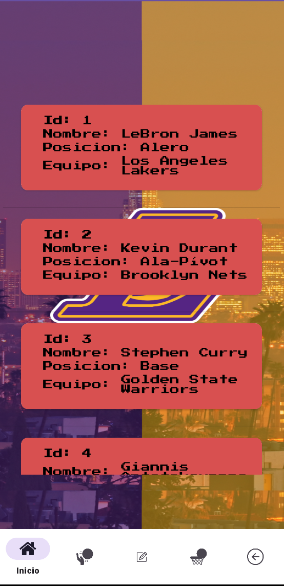
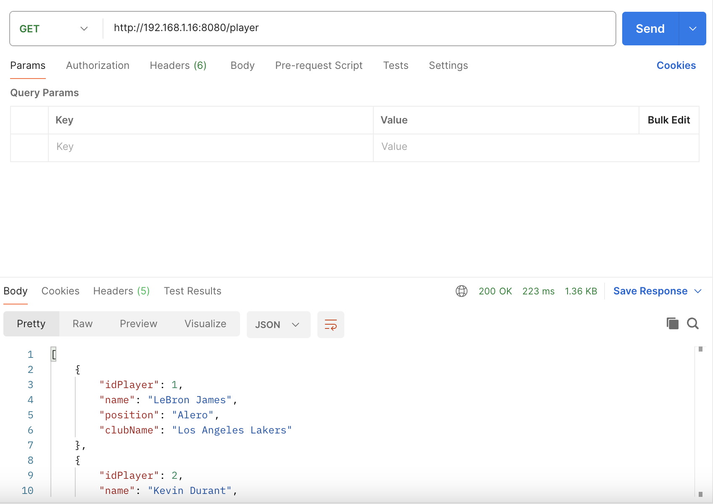

## Proyecto

He seleccionado una API propia sobre jugadores de la NBA ya que soy muy fan.
En el que a mi proyecto de Android le he añadido login de google para la obtención de la máxima nota.

## Login de Google 

Para poder añadir el login de google al proyecto, he tenido que hacer varias cosas.

1.- Ver  y seguir los pasos de un vídeo de Mouredev
2.- El video se encuentra en código Kotlin y lo he tenido que traducir a java.
3.- Ir a Firebase para crear un proyecto de Android con mi cuenta
4.- Ejecutar este comando:./gradlew signingReport para conseguir el sha1.
5.- Una vez creado el proyecto Android en Firebase, tenemos que descargarnos el json que nos da y agregarlo a la carpeta app de nuestro proyecto.
6.-Añadir el token en el código de java
7.- Implemento las dependencias que te dice Firebase paso a paso.

## Dependencias para Login de Google 

1.- Añado este código en el androidmanifest.xml para que me funcione el login en donde en el meta-data tienes que poner tu token que se encuentra en el json.

2.- Añadir plugin de google en el build.gradle a nivel de proyecto

3.- A nivel de app tienes que implementar 3 códigos que te dice el Firebase para implementar el login
.

## Backend de mi app de Android.

# PlayerAdapter

La clase `PlayerAdapter` es un adaptador personalizado para mostrar objetos `Player` en una lista en una aplicación Android. Extiende la clase `BaseAdapter` y proporciona funcionalidad para vincular los datos de la lista de jugadores con las vistas de un ListView.

## Constructor

### PlayerAdapter(Context context, List<Player> playerList)

Constructor que crea un nuevo adaptador con el contexto dado y la lista de jugadores.

- `context`: El contexto en el que se está utilizando el adaptador.
- `playerList`: La lista de objetos `Player` que se mostrarán en el adaptador.

## Métodos

### getCount()

Devuelve el número de elementos en el adaptador, que es el tamaño de `playerList`.

### getItem(int position)

Devuelve el objeto `Player` en la posición especificada en el conjunto de datos del adaptador.

- `position`: La posición del elemento dentro del conjunto de datos del adaptador.

### getItemId(int position)

Devuelve el identificador del elemento en la posición especificada en la lista.

- `position`: La posición del elemento dentro del conjunto de datos del adaptador.

### getView(int position, View convertView, ViewGroup parent)

Obtiene una vista que muestra los datos en la posición especificada en el conjunto de datos.

- `position`: La posición del elemento dentro del conjunto de datos del adaptador.
- `convertView`: La vista antigua que se reutilizará, si es posible.
- `parent`: El padre al que finalmente se adjuntará esta vista.

### ViewHolder

Una clase estática interna para contener las vistas de cada elemento en el ListView y evitar llamadas innecesarias a `findViewById()`.

#### Campos

- `idLabel`: TextView para mostrar la etiqueta "Id".
- `idText`: TextView para mostrar el valor del ID del jugador.
- `nameLabel`: TextView para mostrar la etiqueta "Nombre".
- `nameText`: TextView para mostrar el nombre del jugador.
- `positionLabel`: TextView para mostrar la etiqueta "Posición".
- `positionText`: TextView para mostrar la posición del jugador.
- `equipoLabel`: TextView para mostrar la etiqueta "Equipo".
- `equipoText`: TextView para mostrar el nombre del equipo del jugador.

# CRUDInterfaces

Interfaz que define las operaciones CRUD (Crear, Leer, Actualizar, Eliminar) para objetos `Player` en el servidor.

## Métodos

### getAll()

Recupera todos los objetos `Player` del servidor de manera asíncrona.

### create(Player player)

Crea un nuevo objeto `Player` en el servidor.

- `player`: El objeto `Player` que se va a crear.

### actualizar(int id, Player player)

Actualiza un objeto `Player` existente en el servidor.

- `id`: El ID del objeto `Player` que se va a actualizar.
- `player`: El objeto `Player` actualizado.

### delete(int id)

Elimina un objeto `Player` del servidor.

- `id`: El ID del objeto `Player` que se va a eliminar.

# Player (model)

La clase `Player` representa a un jugador en un equipo. Contiene atributos como el ID del jugador, su nombre, posición y el nombre del club al que pertenece.

## Constructores

### Player()

Constructor por defecto para la clase `Player`.

### Player(int idPlayer, String name, String position, String clubName)

Constructor que crea un objeto `Player` con los atributos especificados.

- `idPlayer`: El identificador único del jugador.
- `name`: El nombre del jugador.
- `position`: La posición del jugador.
- `clubName`: El nombre del club al que pertenece el jugador.

## Métodos

### getIdPlayer()

Método de acceso para obtener el ID del jugador.

### setIdPlayer(int idPlayer)

Método de modificación para establecer el ID del jugador.

- `idPlayer`: El ID del jugador que se va a establecer.

### getName()

Método de acceso para obtener el nombre del jugador.

### setName(String name)

Método de modificación para establecer el nombre del jugador.

- `name`: El nombre del jugador que se va a establecer.

### getPosition()

Método de acceso para obtener la posición del jugador.

### setPosition(String position)

Método de modificación para establecer la posición del jugador.

- `position`: La posición del jugador que se va a establecer.

### getClubName()

Método de acceso para obtener el nombre del club al que pertenece el jugador.

### setClubName(String clubName)

Método de modificación para establecer el nombre del club al que pertenece el jugador.

- `clubName`: El nombre del club al que pertenece el jugador que se va a establecer.

### toString()

Sobrescribe el método `toString` para proporcionar una representación de cadena formateada del objeto `Player`.

## Atributos

- `idPlayer`: El identificador único del jugador.
- `name`: El nombre del jugador.
- `position`: La posición del jugador.
- `clubName`: El nombre del club al que pertenece el jugador.

# Constants

La clase `Constants` contiene constantes utilizadas en la aplicación.

## Constantes

### BASE_URL

La URL base para el punto final de la API en este caso es la ip en mi casa.

- Valor: `http://192.168.1.16:8080/`

# actualizar
.

La clase `actualizar` es un fragmento utilizado para actualizar la información de un jugador en la aplicación.

## Atributos

- `nameText`: EditText para ingresar el nombre del jugador.
- `posicionText`: EditText para ingresar la posición del jugador.
- `equipoText`: EditText para ingresar el equipo del jugador.
- `button`: Botón utilizado para iniciar el proceso de actualización.
- `idText`: EditText para ingresar el ID del jugador a actualizar.
- `retrofit`: Instancia de Retrofit utilizada para realizar llamadas a la API.
- `crudInterfaces`: Interfaz utilizada para definir las operaciones CRUD en la API.

## Métodos

### onCreateView(LayoutInflater inflater, ViewGroup container, Bundle savedInstanceState)

Método llamado cuando se crea la vista del fragmento. Infla el diseño del fragmento y configura los elementos de la interfaz de usuario.

### actualizar()

Método llamado cuando se hace clic en el botón de actualización. Recupera los datos ingresados por el usuario, verifica si están completos y llama al método `actualizar` en la interfaz de CRUD para actualizar el jugador en el servidor.

### mostrarToast(String mensaje)
.

Método para mostrar un mensaje corto en forma de Toast en la pantalla.

.

# anadir
.
Fragmento utilizado para añadir un jugador a la aplicación.

## Atributos

- `nameText`: EditText para ingresar el nombre del jugador.
- `idText`: EditText para ingresar el ID del jugador.
- `posicionText`: EditText para ingresar la posición del jugador.
- `equipoText`: EditText para ingresar el equipo del jugador.
- `button`: Botón utilizado para iniciar el proceso de creación del jugador.
- `crudInterfaces`: Interfaz utilizada para definir las operaciones CRUD en la API.

## Métodos

### onCreateView(LayoutInflater inflater, ViewGroup container, Bundle savedInstanceState)

Método llamado para crear la vista que representa el fragmento. Infla el diseño del fragmento y configura los elementos de la interfaz de usuario.

### create(Player player)

Método para crear un nuevo jugador. Realiza una llamada a la API para agregar el jugador al servidor.

### mostrarToast(String mensaje)

Método para mostrar un mensaje corto en forma de Toast en la pantalla.

## Constructor

### anadir()

Constructor vacío requerido por el Fragment.

# borrar
.

Fragmento utilizado para eliminar un jugador de la aplicación.

## Atributos

- `crudInterfaces`: Interfaz utilizada para definir las operaciones CRUD en la API.
- `button`: Botón utilizado para iniciar el proceso de eliminación del jugador.
- `idEditText`: EditText para ingresar el ID del jugador a ser eliminado.

## Métodos

### onCreateView(LayoutInflater inflater, ViewGroup container, Bundle savedInstanceState)

Método llamado para crear la vista que representa el fragmento. Infla el diseño del fragmento y configura los elementos de la interfaz de usuario.

### setupDeleteButton(View view)

Método para configurar el botón de borrado. Agrega un listener de clic al botón para manejar la eliminación del jugador.

### delete(int id)

Método para eliminar un jugador de la base de datos. Realiza una llamada a la API para borrar el jugador con el ID especificado.

### mostrarToast(String mensaje)

Método para mostrar un mensaje corto en forma de Toast en la pantalla.

## Constructor

### borrar()

Constructor vacío requerido por el Fragment.

captura6

# FrameLayaout
.

Actividad principal que gestiona la navegación y las acciones del usuario en la aplicación.

## Atributos

- `salirApp`: Instancia de FirebaseAuth para gestionar la autenticación y el cierre de sesión.
- `caraTriste`: Emoji representando una cara triste.
- `caraFeliz`: Emoji representando una cara feliz.

## Métodos

### onCreate(Bundle savedInstanceState)

Método llamado al crear la actividad. Configura la vista, inicializa Firebase Authentication, configura la barra de navegación inferior y maneja la navegación entre fragmentos.

### logOut()

Método para cerrar sesión y redirigir al usuario a la pantalla de inicio de sesión.

### goLogin()

Método para iniciar la actividad de inicio de sesión.

### showLogoutConfirmationDialog()

Método para mostrar un diálogo de confirmación antes de cerrar sesión.

## Constructor

### FrameLayaout()

Constructor vacío requerido por AppCompatActivity.

# inicio

Fragmento utilizado para mostrar una lista de jugadores al usuario.
.

## Atributos

- `players`: Lista de objetos `Player` que contiene los datos de los jugadores obtenidos de la base de datos.
- `crudInterface`: Instancia de la interfaz `CRUDInterfaces` utilizada para realizar operaciones CRUD en la API.
- `listView`: ListView utilizado para mostrar la lista de jugadores en la interfaz de usuario.

## Métodos

### onCreateView(LayoutInflater inflater, ViewGroup container, Bundle savedInstanceState)

Método llamado para crear la vista que representa el fragmento. Infla el diseño del fragmento y configura los elementos de la interfaz de usuario.

### getAll()

Método para obtener todos los jugadores de la base de datos mediante una llamada a la API. Configura un adaptador personalizado (`PlayerAdapter`) para mostrar los jugadores en el `listView`.

## Constructor

### inicio()

Constructor vacío requerido por Fragment.

# Login

.

Actividad utilizada para iniciar sesión en la aplicación.

## Atributos

- `user`: TextView que muestra el campo de entrada de usuario.
- `pass`: TextView que muestra el campo de entrada de contraseña.
- `message`: TextView que muestra mensajes de estado o errores durante el inicio de sesión.
- `login`: Botón utilizado para iniciar sesión con usuario y contraseña.
- `signInButton`: Botón utilizado para iniciar sesión con Google.

## Atributos para inicio de sesión con Google

- `RC_SIGN_IN`: Código de solicitud para el inicio de sesión con Google.
- `mGoogleSignInClient`: Cliente de inicio de sesión de Google.
- `mAuth`: Instancia de FirebaseAuth para la autenticación de Firebase.

## Métodos

### onCreate(Bundle savedInstanceState)

Método llamado al crear la actividad. Configura la interfaz de usuario, inicializa los componentes y establece los listeners para el inicio de sesión.

### onStart()

Método llamado cuando la actividad se vuelve visible para el usuario. Verifica si el usuario ya ha iniciado sesión y actualiza la interfaz de usuario en consecuencia.

### signIn()

Método para iniciar el proceso de inicio de sesión con Google.

### onActivityResult(int requestCode, int resultCode, Intent data)

Método llamado después de que la actividad obtiene un resultado de otra actividad, en este caso, el resultado de iniciar sesión con Google.

### firebaseAuthWithGoogle(String idToken)

Método para autenticar con Firebase utilizando el token de ID de Google.

### updateUI(FirebaseUser user)

Método para actualizar la interfaz de usuario después de la autenticación.

### goHome()

Método para ir a la página principal de la aplicación después de iniciar sesión correctamente.

### login(View view)

Método para iniciar sesión con usuario y contraseña.

### entrar(View view)

Método para iniciar sesión al presionar el botón de entrada.

# API

La api que he hecho es sencillita pero completa.

# PlayerController

Este controlador maneja las solicitudes relacionadas con los jugadores en la API.

## Endpoints

### Obtener todos los jugadores

- **URL**
  `/player`
  
- **Método HTTP**
  `GET`
  
- **Respuesta Exitosa**
  Código: `200 OK`
  Contenido: Lista de objetos `Player`

### Obtener jugador por ID

- **URL**
  `/player/{id}`
  
- **Método HTTP**
  `GET`
  
- **Parámetros de Ruta**
  `id` (int): ID del jugador
  
- **Respuesta Exitosa**
  Código: `200 OK`
  Contenido: Objeto `Player`

### Añadir un jugador

- **URL**
  `/player`
  
- **Método HTTP**
  `POST`
  
- **Cuerpo de la Solicitud**
  Objeto `PlayerDTO`
  
- **Respuesta Exitosa**
  Código: `200 OK`
  Contenido: Objeto `Player` recién añadido

### Actualizar un jugador

- **URL**
  `/player/{id}`
  
- **Método HTTP**
  `PUT`
  
- **Parámetros de Ruta**
  `id` (int): ID del jugador
  
- **Cuerpo de la Solicitud**
  Objeto `PlayerDTO`
  
- **Respuesta Exitosa**
  Código: `200 OK`
  Contenido: Objeto `Player` actualizado

### Borrar un jugador

- **URL**
  `/player/{id}`
  
- **Método HTTP**
  `DELETE`
  
- **Parámetros de Ruta**
  `id` (int): ID del jugador
  
- **Respuesta Exitosa**
  Código: `204 No Content`

## Métodos

### obtenerPlayer()

- **Método HTTP**
  `GET`
  
- **Descripción**
  Devuelve todos los jugadores almacenados.
  
- **Retorno**
  Lista de objetos `Player`

### obtenerJugadorporId(int id)

- **Método HTTP**
  `GET`
  
- **Descripción**
  Devuelve un jugador específico según su ID.
  
- **Parámetros**
  `id` (int): ID del jugador
  
- **Retorno**
  Objeto `Player`

### convertirDTOaJugador(PlayerDTO playerDTO)

- **Descripción**
  Convierte un objeto `PlayerDTO` en un objeto `Player`.
  
- **Parámetros**
  `playerDTO` (PlayerDTO): Objeto DTO del jugador
  
- **Retorno**
  Objeto `Player`

### anadirJugador(PlayerDTO playerDTO)

- **Método HTTP**
  `POST`
  
- **Descripción**
  Añade un nuevo jugador a la base de datos.
  
- **Parámetros**
  `playerDTO` (PlayerDTO): Objeto DTO del jugador
  
- **Retorno**
  Objeto `Player` recién añadido

### actualizarJugador(int id, PlayerDTO playerDTO)

- **Método HTTP**
  `PUT`
  
- **Descripción**
  Actualiza la información de un jugador existente.
  
- **Parámetros**
  `id` (int): ID del jugador
  `playerDTO` (PlayerDTO): Objeto DTO del jugador
  
- **Retorno**
  Objeto `Player` actualizado

### borrarJugador(int id)

- **Método HTTP**
  `DELETE`
  
- **Descripción**
  Elimina un jugador existente de la base de datos.
  
- **Parámetros**
  `id` (int): ID del jugador

# PlayerDTO

Esta clase representa un objeto de transferencia de datos (DTO) para la entidad Player en la API.

## Atributos

- `name` (String): El nombre del jugador.
- `position` (String): La posición del jugador.
- `clubName` (String): El nombre del club al que pertenece el jugador.

## Anotaciones

- `@NoArgsConstructor`: Genera un constructor sin argumentos.
- `@AllArgsConstructor`: Genera un constructor con todos los argumentos.
- `@Data`: Genera automáticamente getters, setters, `toString()`, `equals()` y `hashCode()`.
- `@Builder`: Permite construir objetos utilizando el patrón Builder.

## Métodos

No se definen métodos explícitamente en esta clase, ya que los getters y setters son generados automáticamente por la anotación `@Data`.

## Constructores

- `PlayerDTO()`: Constructor sin argumentos generado automáticamente.
- `PlayerDTO(String name, String position, String clubName)`: Constructor con todos los argumentos generado automáticamente.

## Builder

El patrón Builder permite crear instancias de `PlayerDTO` de manera más legible y flexible.

# Player

Esta clase representa la entidad Player en la base de datos.

## Atributos

- `idPlayer` (int): Identificador único del jugador.
- `name` (String): El nombre del jugador.
- `position` (String): La posición del jugador.
- `clubName` (String): El nombre del club al que pertenece el jugador.

## Anotaciones

- `@NoArgsConstructor`: Genera un constructor sin argumentos.
- `@AllArgsConstructor`: Genera un constructor con todos los argumentos.
- `@Getter`: Genera automáticamente los métodos getters para todos los atributos.
- `@Setter`: Genera automáticamente los métodos setters para todos los atributos.
- `@Entity`: Indica que esta clase es una entidad JPA.
- `@Table(name = "T_PLAYER")`: Especifica el nombre de la tabla en la base de datos.

## Métodos

- `Player()`: Constructor sin argumentos generado automáticamente.
- `Player(String name, String position, String clubName)`: Constructor con todos los argumentos que inicializa los atributos de la clase.
- Getters y setters automáticos generados por las anotaciones `@Getter` y `@Setter`.

## Persistencia en la Base de Datos

- `idPlayer`: Clave primaria generada automáticamente con la estrategia de identidad.
- `name`, `position`, `clubName`: Columnas en la tabla `T_PLAYER` que almacenan los datos del jugador.

# PlayerServiceImp

Esta clase implementa la interfaz `PlayerService` y proporciona la lógica de negocio para la gestión de jugadores en la API.

## Atributos

- `playerRepository` (PlayerRepository): Repositorio utilizado para acceder a los datos de los jugadores en la base de datos.

## Métodos

### obtenerJugadores()

- **Descripción**
  Obtiene todos los jugadores almacenados en la base de datos.

- **Retorno**
  Lista de objetos `Player`.

### obtenerJugadorID(int id)

- **Descripción**
  Obtiene un jugador específico por su ID.

- **Parámetros**
  `id` (int): ID del jugador.

- **Retorno**
  Objeto `Player` correspondiente al ID especificado, o `null` si no se encuentra.

### anadirJugador(Player player)

- **Descripción**
  Añade un nuevo jugador a la base de datos.

- **Parámetros**
  `player` (Player): Objeto `Player` a añadir.

- **Retorno**
  Objeto `Player` recién añadido.

### actualizarJugador(int id, Player player)

- **Descripción**
  Actualiza la información de un jugador existente en la base de datos.

- **Parámetros**
  `id` (int): ID del jugador a actualizar.
  `player` (Player): Objeto `Player` con los nuevos datos.

- **Retorno**
  Objeto `Player` actualizado, o `null` si el jugador no existe.

### borrarJugador(int id)

- **Descripción**
  Elimina un jugador existente de la base de datos.

- **Parámetros**
  `id` (int): ID del jugador a eliminar.

## SQL

Ya por último en la API lo que he hecho es un import de los querys de la base de datos para añadir jugadores de la NBA

## PostMan

.

